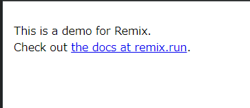
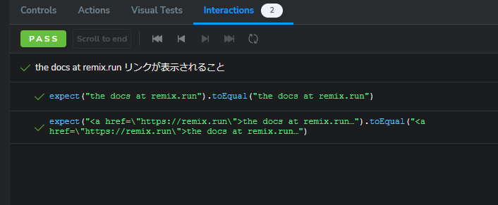

# Remix Tutorial Advanced hands-on

Remix Tutorial の Advanced hands-on として以下の内容に挑戦します。

1. ~~storybookを導入してコンポーネントのstoryを作る~~
2. storybookのplay機能を使ってinteraction testを書く
3. storybookのテストランナーでコマンドラインからテストを起動する
4. chromaticを設定してビジュアル・リグレッション・テストの環境を作る

# 2. storybookのplay機能を使ってinteraction testを書く

## storybookのデモ削除

初期導入時にインストールされたデモ(`stories/`)を削除します。

## 対象パスの変更

storiesファイルの対象パスを`app/`以下に変更する。

`.stories/main.ts`の`stories`部分を変更する。

```
  stories: [
    "../app/**/*.stories.@(js|jsx|mjs|ts|tsx)",
  ],
```
## _indexのストーリー作成

`app/routes/_index/route.ts`のストーリーを作成します。

`app/routes/_index/_index.stories.tsx`
```
import type { Meta, StoryObj } from '@storybook/react';

import Index from './route';

const meta: Meta<typeof Index> = {
  title: 'index',
  component: Index,
  tags: ['autodocs'],
};

export default meta;
type Story = StoryObj<typeof Index>;

export const Default: Story = {};
```

```
npm run storybook
```



CSSが効いていないのでCSSを適用します。

## CSSの適用

Storybook公式ページの[Styling and CSS](https://storybook.js.org/docs/configure/styling-and-css)を参考に、`.storybook/preview.ts`を修正します。

```
import type { Preview } from "@storybook/react";
import '../app/app.css'

const preview: Preview = {
  parameters: {
    controls: {
      matchers: {
        color: /(background|color)$/i,
        date: /Date$/i,
      },
    },
  },
};

export default preview;
```


## Interaction tests設定

playを使いテストを記述します。

interactions addonをセットアップします。

```
npm install @storybook/test @storybook/addon-interactions --save-dev
```

## interaction testsを書く

`app/routes/_index/_index.stories.tsx`

`play`を追加します。

```
import type { Meta, StoryObj } from '@storybook/react';
import { within, expect } from '@storybook/test';

import Index from './route';

const meta: Meta<typeof Index> = {
  title: 'index',
  component: Index,
  tags: ['autodocs'],
};

export default meta;
type Story = StoryObj<typeof Index>;

export const Default: Story = {
  play: async ({ canvasElement, step }) => {
    const canvas = within(canvasElement);

    await step('the docs at remix.run リンクが表示されること', async () => {
      const element = canvas.getByRole('link');
      expect(element.textContent).toEqual('the docs at remix.run');
      expect(element.outerHTML).toEqual('<a href="https://remix.run">the docs at remix.run</a>')
    })
  }
};
```

interaction test 実行状況が表示されます。


