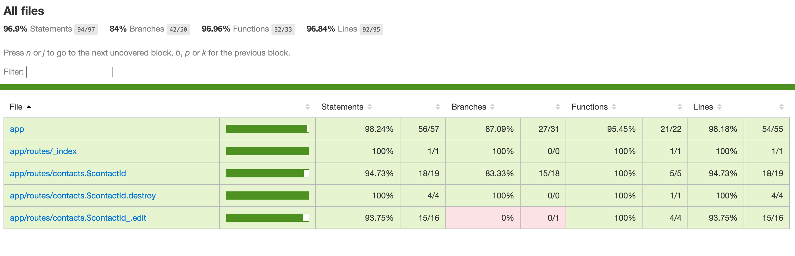

# Remix Tutorial Advanced hands-on

Remix Tutorial の Advanced hands-on として以下の内容に挑戦します。

1. ~~storybookを導入してコンポーネントのstoryを作る~~
2. ~~storybookのplay機能を使ってinteraction testを書く~~
3. storybookのテストランナーでコマンドラインからテストを起動する
4. chromaticを設定してビジュアル・リグレッション・テストの環境を作る

# 3. storybookのテストランナーでコマンドラインからテストを起動する

## テストランナーセットアップ

[Srtorybook公式のテストランナーページ](https://storybook.js.org/docs/writing-tests/test-runner)を参考にテストランナーをインストールして、コマンドラインからテストを起動できるようにします。

```
npm install @storybook/test-runner --save-dev
```

## package.jsonにテストランナーコマンドを追加

```
{
  "scripts": {
    "test-storybook": "test-storybook"
  }
}
```

## test動かしてみる

```
npm run test-storybook
```

```
> test-storybook
> test-storybook

 PASS   browser: chromium  app/routes/_index/_index.stories.tsx
 PASS   browser: chromium  app/routes/contacts.$contactId/contact.stories.tsx (6.303 s)
 PASS   browser: chromium  app/root.stories.tsx (10.501 s)
 PASS   browser: chromium  app/routes/contacts.$contactId_.edit/edit.stories.tsx (10.556 s)

Test Suites: 4 passed, 4 total
Tests:       11 passed, 11 total
Snapshots:   0 total
Time:        11.814 s
Ran all test suites.
```

## カバレージもセットアップ

```
npm install @storybook/addon-coverage --save-dev
```

`.storybook/main.ts`にアドオンを追加

```
// Replace your-framework with the framework and builder you are using (e.g., react-webpack5, vue3-webpack5)
import type { StorybookConfig } from '@storybook/your-framework';

const config: StorybookConfig = {
  stories: [],
  addons: [
    // Other Storybook addons
    '@storybook/addon-coverage', //👈 Registers the addon
  ],
};

export default config;
```

## レポートツールをセットアップ

```
npx nyc report --reporter=lcov -t coverage/storybook --report-dir coverage/storybook
```

## カバレージ実行

```
npm run test-storybook -- --coverage
```

ブラウザでレポートを開いて確認します。

`file:///{path to project}/coverage/storybook/lcov-report/index.html`



