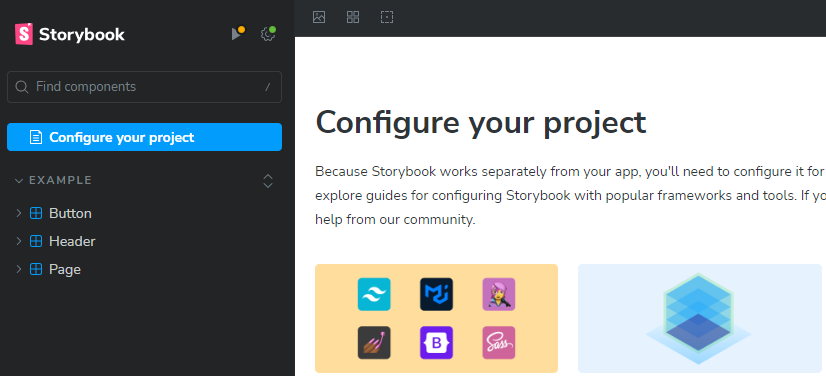

# Remix Tutorial Advanced hands-on

Remix Tutorial の Advanced hands-on として以下の内容に挑戦します。

1. storybookを導入してコンポーネントのstoryを作る
2. storybookのplay機能を使ってinteraction testを書く
3. storybookのテストランナーでコマンドラインからテストを起動する
4. chromaticを設定してビジュアル・リグレッション・テストの環境を作る

# 1. storybookを導入してコンポーネントのstoryを作る

## storybookを導入する

[Remix v2 に Storybookを導入してみた](https://zenn.dev/m_ryosuke/articles/868eacfc1870c0) を参考にstorybookを導入していきます。

### storybookをインストール
```
npx storybook init
```

下記のエラーが表示されるので対策していきます。
```
Running Storybook

> storybook
> storybook dev -p 6006 --initial-path=/onboarding --quiet

@storybook/cli v8.0.8

info => Starting manager..
info => Starting preview..
=> Failed to build the preview
Error: The Remix Vite plugin requires the use of a Vite config file
```

### Storybook用のvite-sb.config.tsを生成

`vite-sb.config.ts`を新規にプロジェクトルートに作成します。
```
import { defineConfig, loadEnv } from 'vite';
import tsconfigPaths from 'vite-tsconfig-paths';

export default defineConfig(({ mode }) => {
  const env = loadEnv(mode, process.cwd(), '');
  process.env = { ...process.env, ...env };
  return {
    plugins: [tsconfigPaths()],
  };
});
```

### .storybook/main.ts の修正

`.storybook/main.ts`の`framework`を以下のように修正します。

```
 framework: {
   name: "@storybook/react-vite",
   options: {
     builder: {
       viteConfigPath: 'vite-sb.config.ts',
     }
   },
```

再度storybookを起動します。

```
npm run storybook
```



